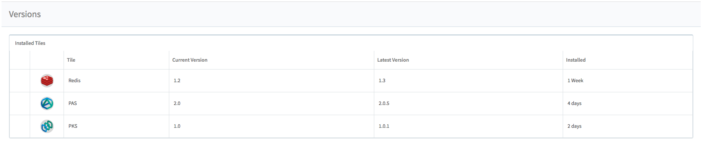
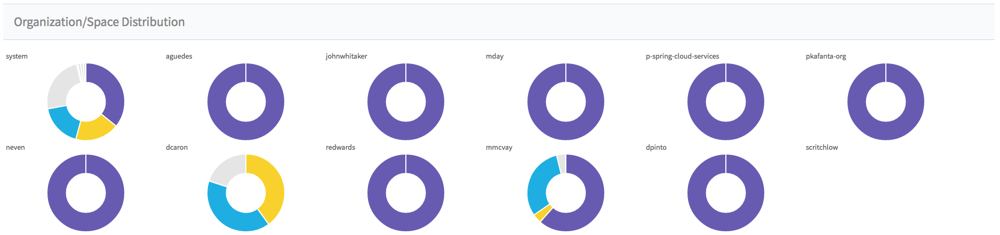

# Overview 

As a customer it can be extremely useful to have a dashboard showing the overall usage of your PCF deployments.

This is especially true when you have multiple-foundations and want to get a consolidated view of the world.

Based on initial interviews with customers that already have similar in-house tools/spreadsheets the following overall functionality has been highlighted (in no particular order); 

* Capacity
    * Allocated vs Consumed
* Org
    * Count
    * Name
    * Capacity
* Application Instances
    * Total
    * Running
* Apps
    * Buildpack (general grouping i.e. Java/Go etc.)
    * Memory
    * No of AIs
    * Disk
    * State
    * Create time
    * Update time
* Aggregate
    * Dev foundations
    * Prod foundations
* Per foundation
    * Tiles & Versions
    * Dev/Prod
    * URL OpsMgr
    * API
* Quota Definitions
* Buildpack Usage
    * Identify lack of migrations - app/LoB/org/space
* LoB/Team classification
* GUIDs are important to track (names change GUIDs are consistent)
* App Crash Report
* Metadata
    * Billing Codes
    * LoB
    * Org Creation Date
    * Org Owner + Contacts
    * Foundation Name/country etc.

The implementation of this can be split into a number of different components/microservices that will run on PCF.

## Goals
The goal of this work is to provide a way for customers to visualise data from foundations, in a single point,

## Anti-Goals
 * Not duplicate Healthwatch functionality (although might extract data from Healthwatch)
 * Not duplicate Metrics functionality
 * Duplicate any other existing Pivotal tool, if the functionality does not work as required then feedback to that team should be provided
 * Calling this a "single pane of glass"

# MVP/PoC
The following is the mock up of the front-end, it contains a mixture of real collected data and mocked up data.







# Yet to do

- [x] Basic MVP collection of data
- [ ] MVP Dashboard
    - [ ] Tidy up HTML/JS in MVP
- [ ] Track the project to help with prioritisation and collaboration
- [ ] pipeline the deployment of the app
- [ ] Testing
- [ ] SpringBoot app for collection of data
- [ ] Persistent storage of the data 
- [ ] PKS

# Data 
The data used by the dashboard is extracted from a JSON payload (this is collected by a [Concourse pipeline](https://github.com/clijockey/phoenix-concourse-collector) at the moment, this will be replaced by a SpringBoot app).


## JSON Format

```
{
        "name": "myOrg",
        "guid": "78f6c703-a2d2-4a8e-aa05-9a11f9f358ca",
        "total_app_instance_count": 0,
        "total_app_memory_used_in_mb": 0,
        "total_disk_quota_in_mb": 0,
        "service_usages": [],
        "buildpack_usages": {},
        "spaces": [
          {
            "guid": "3a5fb3a4-13f0-4cb3-b3ae-3b78cf88e85f",
            "name": "dev",
            "total_app_instance_count": 0,
            "total_app_memory_used_in_mb": 0,
            "total_disk_quota_in_mb": 0,
            "app_usages": [],
            "buildpack_usages": {},
            "service_usages": []
          }
        ],
        "quota_plan": {
          "name": "default",
          "non_basic_services_allowed": true,
          "total_services": 100,
          "total_routes": 1000,
          "total_private_domains": -1,
          "memory_limit": 10240000,
          "trial_db_allowed": false,
          "instance_memory_limit": -1,
          "app_instance_limit": -1,
          "app_task_limit": -1,
          "total_service_keys": -1,
          "total_reserved_route_ports": 99,
          "guid": "9bb78144-ea7c-489d-8d89-565129cc52b7"
        }
      },
      {
        "name": "on-demand-smoke-test-org",
        "guid": "e2c28a0f-5835-4dc8-b772-e4b82622a9e0",
        "total_app_instance_count": 0,
        "total_app_memory_used_in_mb": 0,
        "total_disk_quota_in_mb": 0,
        "service_usages": [],
        "buildpack_usages": {},
        "spaces": [
          {
            "guid": "3c4b5708-9a16-442e-8f44-a2ddfbdfae1d",
            "name": "on-demand-smoke-test-space",
            "total_app_instance_count": 0,
            "total_app_memory_used_in_mb": 0,
            "total_disk_quota_in_mb": 0,
            "app_usages": [],
            "buildpack_usages": {},
            "service_usages": []
          }
        ],
        "quota_plan": {
          "name": "cf-rabbitmq-smoke-tests-quota",
          "non_basic_services_allowed": true,
          "total_services": 100,
          "total_routes": 1000,
          "total_private_domains": -1,
          "memory_limit": 10240,
          "trial_db_allowed": false,
          "instance_memory_limit": -1,
          "app_instance_limit": -1,
          "app_task_limit": -1,
          "total_service_keys": -1,
          "total_reserved_route_ports": 0,
          "guid": "c58ecef2-4711-4790-9c0f-0e538414b3e6"
        }
      }
    ],
    "pcf_deploy_name": "demo-lab",
    "start_date": "2018-01-01",
    "end_date": "2018-01-31",
    "total_app_instance_count": 312,
    "total_app_memory_used_in_mb": 242688,
    "total_disk_quota_in_mb": 211008,
    "service_usages": [
      {
        "service_guid": "3f6cbeab-a2e1-4759-9914-b6854827cd72",
        "service_instance_guid": "3f6cbeab-a2e1-4759-9914-b6854827cd72",
        "instances": 13,
        "service_name": "p-mysql",
        "deleted": false,
        "creation": "2017-10-25T12:32:35.000Z",
        "deletion": null,
        "plan_guid": "01a96e8a-4db2-4ff1-8b3d-9f098fbd6e51",
        "plan_name": "100mb",
        "duration_in_seconds": 23303426,
        "extra": "{\"costs\":[{\"amount\":{\"usd\":0.0},\"unit\":\"MONTH\"}],\"bullets\":[\"100MB default\",\"100 MB storage\",\"40 concurrent connections\"],\"displayName\":\"100mb\"}"
      },
      {
        "service_guid": "9e8d8341-ddfc-4dcf-8806-86184b3f987d",
        "service_instance_guid": "9e8d8341-ddfc-4dcf-8806-86184b3f987d",
        "instances": 12,
        "service_name": "p-rabbitmq",
        "deleted": false,
        "creation": "2017-10-25T12:32:38.000Z",
        "deletion": null,
        "plan_guid": "82ced3d1-fe84-48f2-a95c-21ef0e408e57",
        "plan_name": "standard",
        "duration_in_seconds": 18542542,
        "extra": "{\"displayName\":\"Standard\",\"costs\":[{\"amount\":{\"usd\":0.0},\"unit\":\"MONTHLY\"}],\"bullets\":[\"RabbitMQ\",\"Multi-tenant\"]}"
      },
      {
        "service_guid": "def8a2da-3c4e-453f-81e5-8ed0e51e0381",
        "service_instance_guid": "def8a2da-3c4e-453f-81e5-8ed0e51e0381",
        "instances": 5,
        "service_name": "kubo-odb",
        "deleted": true,
        "creation": "2017-10-16T16:53:15.000Z",
        "deletion": "2018-02-07T10:40:03.000Z",
        "plan_guid": "669599af-cf06-4737-a963-c7a6fa4a4cdc",
        "plan_name": "demo",
        "duration_in_seconds": 11533328
      },
      {
        "service_guid": "3b48c03f-6890-457b-93a8-c211e60a81eb",
        "service_instance_guid": "3b48c03f-6890-457b-93a8-c211e60a81eb",
        "instances": 4,
        "service_name": "google-cloudsql-mysql",
        "deleted": false,
        "creation": "2017-10-19T13:46:24.000Z",
        "deletion": null,
        "plan_guid": "adc434b4-d25d-48da-b3a6-b3384922305f",
        "plan_name": "small",
        "duration_in_seconds": 10713600,
        "extra": "{\"displayName\":\"small\",\"bullets\":[\"Small CloudSQL MySQL Database\",\"For pricing information see https://cloud.google.com/pricing/#details\"]}"
      },
      {
        "service_guid": "43b3499f-ab87-4b6f-928b-cf1dde664e82",
        "service_instance_guid": "43b3499f-ab87-4b6f-928b-cf1dde664e82",
        "instances": 1,
        "service_name": "google-ml-apis",
        "deleted": false,
        "creation": "2017-10-24T12:24:49.000Z",
        "deletion": null,
        "plan_guid": "35d29cc3-2b7c-4fbc-a993-1a284258407d",
        "plan_name": "default",
        "duration_in_seconds": 2678400,
        "extra": "{\"displayName\":\"Default\",\"bullets\":[\"Machine Learning api default plan\",\"For pricing information see https://cloud.google.com/pricing/#details\"]}"
      },
      {
        "service_guid": "7f09bdbc-cbc1-424a-a06e-d455de2593dc",
        "service_instance_guid": "7f09bdbc-cbc1-424a-a06e-d455de2593dc",
        "instances": 4,
        "service_name": "p-service-registry",
        "deleted": false,
        "creation": "2017-11-03T14:51:55.000Z",
        "deletion": null,
        "plan_guid": "aa5b8b42-ae74-4b50-ad0e-798730e0ecd4",
        "plan_name": "standard",
        "duration_in_seconds": 7219466,
        "extra": "{\"bullets\":[\"Single-tenant\",\"Netflix OSS Eureka\"]}"
      },
      {
        "service_guid": "703fff3e-c78e-439a-8600-fa8a2d5d65d3",
        "service_instance_guid": "703fff3e-c78e-439a-8600-fa8a2d5d65d3",
        "instances": 1,
        "service_name": "app-autoscaler",
        "deleted": false,
        "creation": "2018-01-10T15:27:58.000Z",
        "deletion": null,
        "plan_guid": "e51a22b4-e0cf-4503-b72d-e090dee99426",
        "plan_name": "standard",
        "duration_in_seconds": 1845122,
        "extra": "{\"displayName\":\"Standard\",\"bullets\":[\"Scales your app up and down according to user-provided rules\",\"Monitors CPU, HTTP Latency and/or HTTP Throughput every 5 seconds\",\"Waits 30 seconds after every scale event before other scale decisions.\",\"Instance Limits Changes can be scheduled for one-time events in the future\",\"Instance Limits Changes can be scheduled to recur weekly to reduce app costs\",\"Configure via the service management dashboard or service instance API\"],\"costs\":[{\"amount\":{\"usd\":0},\"unit\":\"MONTHLY\"}]}"
      },
      {
        "service_guid": null,
        "service_instance_guid": null,
        "instances": 4,
        "service_name": null,
        "deleted": false,
        "creation": "2018-01-04T09:52:53.000Z",
        "deletion": null,
        "plan_guid": null,
        "plan_name": null,
        "duration_in_seconds": 8478163
      },
      {
        "service_guid": "819b2070-c430-4957-822e-36a980c894a2",
        "service_instance_guid": "819b2070-c430-4957-822e-36a980c894a2",
        "instances": 1,
        "service_name": "p-config-server",
        "deleted": false,
        "creation": "2017-11-22T16:05:16.000Z",
        "deletion": null,
        "plan_guid": "f41ecbc9-ecdb-4015-87da-ba1bd242f3de",
        "plan_name": "standard",
        "duration_in_seconds": 2678400,
        "extra": "{\"bullets\":[\"Single-tenant\",\"Backed by user-provided Git repository\"]}"
      },
      {
        "service_guid": "ea9c814f-a370-4c2d-9dc7-a9dbff408c2b",
        "service_instance_guid": "ea9c814f-a370-4c2d-9dc7-a9dbff408c2b",
        "instances": 1,
        "service_name": "p-circuit-breaker-dashboard",
        "deleted": false,
        "creation": "2017-11-22T16:05:17.000Z",
        "deletion": null,
        "plan_guid": "df5db3be-f018-4a8b-9616-43387921bfec",
        "plan_name": "standard",
        "duration_in_seconds": 2678400,
        "extra": "{\"bullets\":[\"Single-tenant\",\"Netflix OSS Hystrix Dashboard\",\"Netflix OSS Turbine\"]}"
      }
    ],
    "buildpack_usages": {
      "nodejs_buildpack": {
        "guid": "f1f60c41-baff-47a3-a9ca-fde7fb8300bb",
        "name": "nodejs_buildpack",
        "instances": 16
      },
      "ruby_buildpack": {
        "guid": "72427c62-c338-444d-b937-1dcfb9a80cbd",
        "name": "ruby_buildpack",
        "instances": 48
      },
      "binary_buildpack": {
        "guid": "a775d85b-be75-4758-a9a6-51db1bac7690",
        "name": "binary_buildpack",
        "instances": 34
      },
      "java_buildpack_offline": {
        "guid": "93baf4a4-f3b5-42c2-85a7-a0e5fb899d11",
        "name": "java_buildpack_offline",
        "instances": 96
      },
      "go_buildpack": {
        "guid": "b4c8fc57-8a18-43a3-b0fb-64a5a6a562e0",
        "name": "go_buildpack",
        "instances": 3
      },
      "python_buildpack": {
        "guid": "5bf8a00d-c04b-45c6-9cd2-6fb05cef87a2",
        "name": "python_buildpack",
        "instances": 10
      },
      "php_buildpack": {
        "guid": "e45073f6-b6ad-46a9-99a2-8fcd8118ff3f",
        "name": "php_buildpack",
        "instances": 1
      }
    }
  }
```